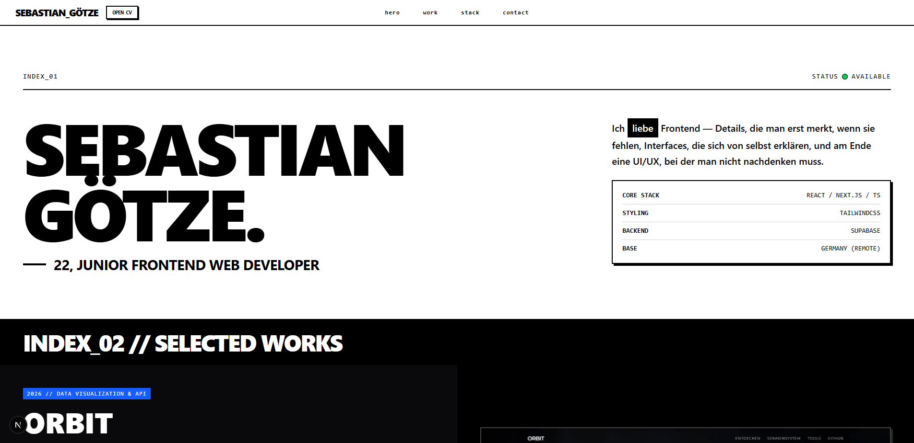

# Portfolio — Sebastian Götze

> Persönliche Portfolio-Seite eines Junior Frontend Developers — Projekt-Showcases, Tech-Stack und Kontaktmöglichkeit an einem Ort.


🔗 **Live-Demo:** [sgoetze.vercel.app](https://sgoetze.vercel.app/)



## Über das Projekt

Meine persönliche Portfolio-Seite: eine Übersicht über mich als Junior Frontend Developer, ausgewählte Projekte im Detail (Problem, Lösung, Tech-Fokus) sowie meinen Tech-Stack und Kontaktmöglichkeiten. Der Aufbau orientiert sich bewusst an einem knappen, editorialen Stil statt einer klassischen Bio-Seite mit langen Fließtexten.

## Struktur

### Hero

Kurzvorstellung mit Name, aktuellem Fokus (Junior Frontend Developer) und Tech-Stack-Übersicht (Core Stack, Styling, Backend, Standort). Im Hero-Satz wechselt das Wort "liebe" beim Hovern zu "lebe" und zurück — ein kleines, bewusst brutalistisches Detail (harter Wechsel statt weicher Transition) mit Touch-Fallback für Mobile.

### Selected Works

Zwei ausführliche Case Studies zu meinen Hauptprojekten, jeweils nach demselben Schema aufgebaut:

- **01. Das Problem** — was die Ausgangslage bzw. Motivation war
- **02. Die Lösung** — was tatsächlich gebaut wurde
- **03. Tech-Fokus** — die technisch relevantesten Aspekte des Projekts

Gezeigt werden aktuell:

- [**Orbit**](https://orbit-two-sigma.vercel.app/) — interaktive Astronomie-Datenvisualisierung mit NASA-API-Anbindung und einer umfangreichen, selbst kuratierten TypeScript-Datenstruktur zu Objekten des Sonnensystems
- [**LinkBloom**](https://linkbloom-two.vercel.app/) — Fullstack Link-in-Bio-Plattform mit Supabase Auth und vollständig anpassbarem Design im kostenlosen Tier

### Tech Stack

Übersicht in vier Kategorien: Core (JS/TS/HTML/CSS), Frameworks & Libraries, Backend & Datenbank (Supabase), sowie Tooling & Workflow (Git, Vercel, Figma).

### Connect

Kontaktmöglichkeit per E-Mail sowie Links zu GitHub und LinkedIn.

## Tech-Stack

- **Next.js** — App Router
- **TypeScript**
- **Tailwind CSS** — Styling
- **react-icons** — Icon-Set
- **Vercel** — Deployment, automatisch von GitHub `main`

## Roadmap

- [ ] Ein paar kleine Easter Eggs auf der Seite
- [ ] Eigene Domain

## Lokal ausführen

```bash
git clone https://github.com/zeroequalsone/portfolio.git
cd portfolio
npm install
npm run dev
```

## Über mich

Ich bin Sebastian Götze, Junior Frontend Developer aus Deutschland, aktuell auf der Suche nach einer Remote-Stelle. Mehr über meine Arbeit in den beiden Projekten oben — [Orbit](https://github.com/zeroequalsone/orbit) und [LinkBloom](https://github.com/zeroequalsone/linkbloom).
